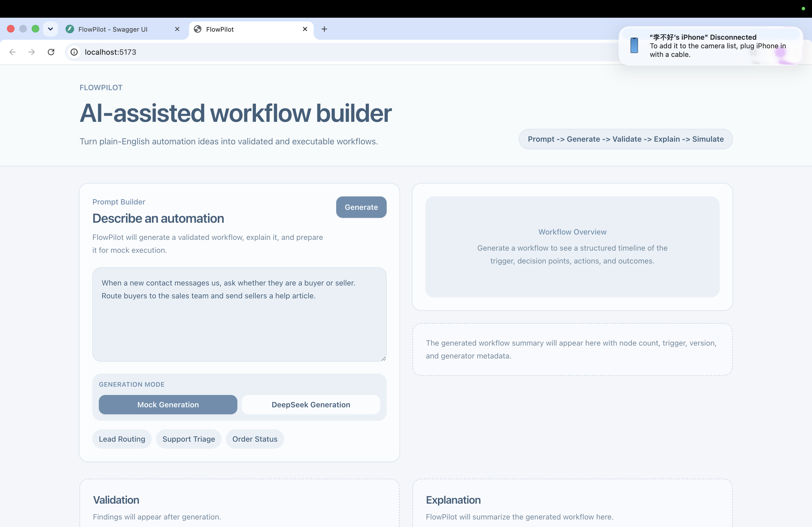
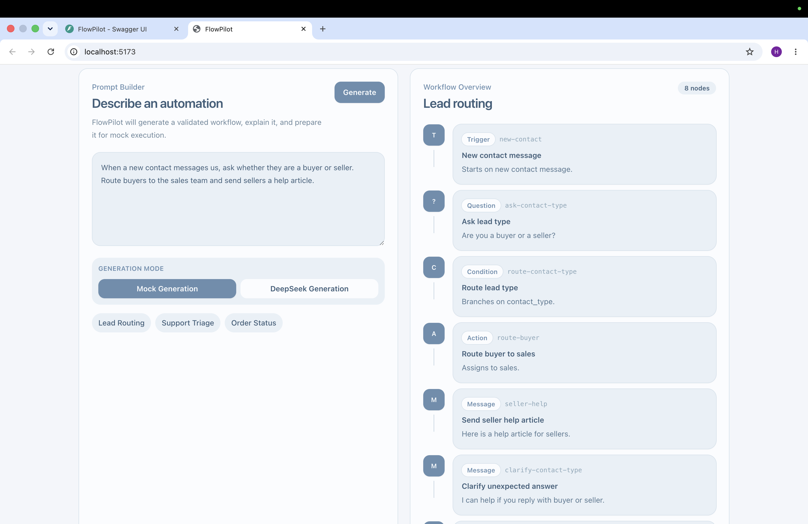
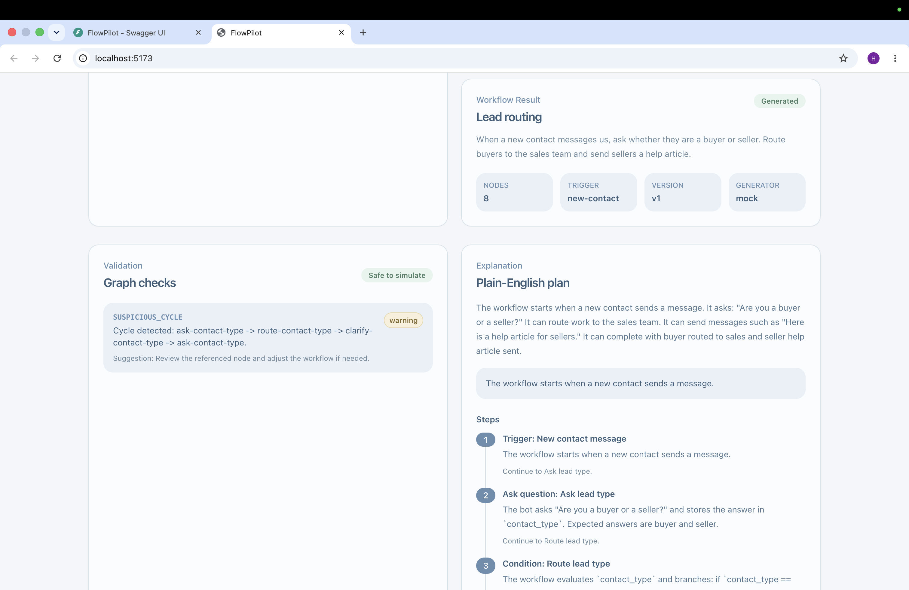
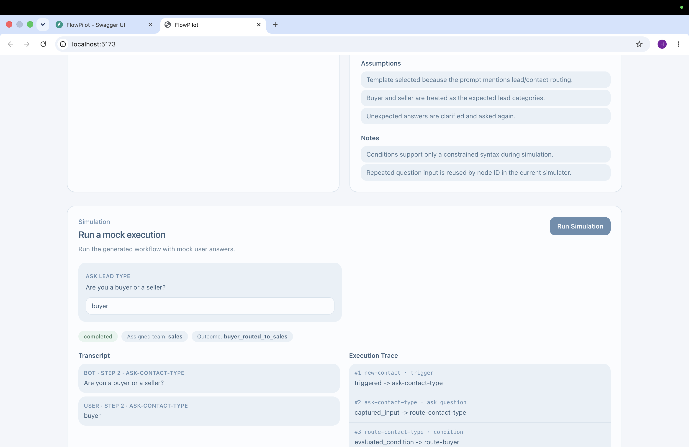
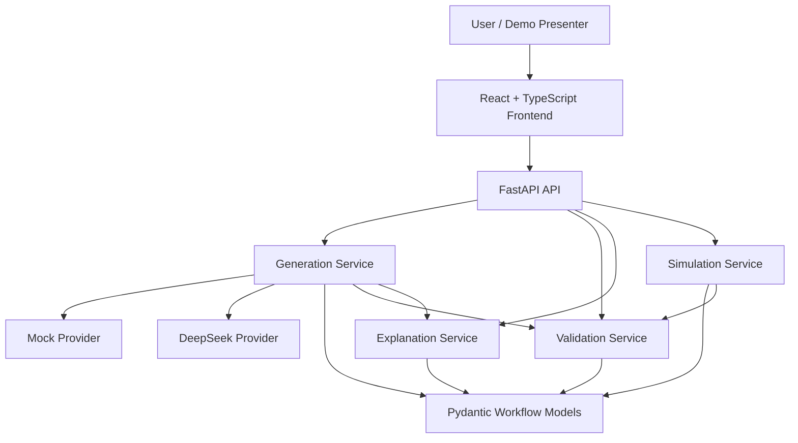

# FlowPilot

FlowPilot is an AI-assisted automation builder that turns plain-English workflow ideas into structured, validated, explainable, and safely simulated automation flows.

It is a public hackathon-style demo focused on the core workflow intelligence layer: generation, validation, explanation, and deterministic mock execution.

## Overview

FlowPilot converts natural-language automation ideas into typed workflow artifacts. Each generated flow is validated before it can be simulated, explained in business-readable language, and executed only in a mock environment with supplied user inputs and mock API outcomes.

The project is intentionally small and demo-oriented. It shows how an AI workflow builder can produce useful automation structure without immediately reaching for production infrastructure, real integrations, or a full visual graph editor.

## Demo

Demo video: _Coming soon._

### Application Overview

The FlowPilot home screen introduces the prompt-driven workflow builder and generation modes.



### Generated Workflow

Mock generation creates a structured workflow timeline from a plain-English automation prompt.



### Validation and Explanation

Generated workflows are validated and translated into a concise plain-English plan before simulation.



### Simulation Execution

The simulator runs the generated workflow with mock user input and shows transcript plus execution trace.



Example prompt:

```text
When a new contact messages us, ask whether they are a buyer or seller.
Route buyers to the sales team and send sellers a help article.
```

FlowPilot can generate the workflow, validate graph risks, explain the business logic, and run a deterministic mock simulation from that prompt.

## Features

### Workflow Generation

- Natural-language prompt input.
- Structured `AutomationFlow` creation.
- Deterministic template-based generation for demo scenarios:
  - lead routing;
  - support triage;
  - order status lookup.
- Optional DeepSeek provider using DeepSeek's OpenAI-compatible chat completion API.
- Vague prompts return a structured clarification response instead of inventing unsupported behavior.

### Validation

- Pydantic schema validation for workflow shape and typed node configuration.
- Deterministic graph validation for dangling transitions, reachability, terminal paths, fallback handling, duplicate transitions, cycles, API success/failure paths, dead ends, and variable usage.
- Findings use stable machine-readable codes and severities: `error`, `warning`, and `info`.

### Explanation

- Business-readable workflow summary.
- Reachable-step walkthrough in deterministic breadth-first order.
- Outcome summaries.
- Validation risks included in explanation output.
- Defensive API URL display that avoids exposing query parameter values.

### Simulation

- Deterministic node-by-node mock execution.
- Supplied user inputs by `ask_question` node ID.
- Supplied mock API outcomes by `api_call` node ID.
- Transcript output for bot/user messages.
- Execution trace output for debugging and demo narration.
- Step-limit protection for loops.
- No real external API calls.

## Architecture

FlowPilot has a standalone React frontend and a FastAPI backend. The backend is organized around typed Pydantic models and focused deterministic services.



### Frontend

- React
- TypeScript
- Vite
- Tailwind CSS
- Single-page demo interface for prompt, generation, validation, explanation, simulation, and raw JSON inspection.

### Backend

- FastAPI application.
- Pydantic v2 models.
- Stateless request/response API endpoints.
- Focused services for generation, validation, explanation, and simulation.

### Services

- `FlowGenerationService`: classifies supported prompts and builds fresh workflow templates.
- `MockWorkflowGenerationProvider`: deterministic, offline generation for stable demos.
- `DeepSeekProvider`: optional OpenAI-compatible LLM generation through DeepSeek.
- `FlowValidationService`: performs deterministic schema-adjacent graph and business-rule validation.
- `FlowExplanationService`: produces deterministic plain-English explanations from flows and validation findings.
- `FlowSimulationService`: runs deterministic mock execution with transcripts, trace entries, and step limits.

### Models

- Workflow domain models: `AutomationFlow`, `FlowNode`, `Transition`, typed node configs, and enums.
- Validation result models.
- Explanation models.
- Simulation request/result models.
- Generation request/response models.

## Workflow Lifecycle

```text
User Intent
  |
  v
Generate Workflow
  |
  v
Validate
  |
  v
Explain
  |
  v
Simulate
```

Validation is the boundary between generated structure and execution. Simulation uses the validation service directly and returns structured failure results when validation errors exist.

## LLM Integration

Mock generation is the default and stable path:

```env
LLM_PROVIDER=mock
```

DeepSeek generation is optional. To use it locally, configure:

```env
LLM_PROVIDER=deepseek
DEEPSEEK_API_KEY=
DEEPSEEK_BASE_URL=https://api.deepseek.com
DEEPSEEK_MODEL=deepseek-chat
LLM_TIMEOUT_SECONDS=30
```

The DeepSeek provider calls the OpenAI-compatible chat completions endpoint and requests JSON-only output matching the `AutomationFlow` schema. The prompt constrains node vocabulary, asks for workflow JSON only, and does not ask the model to generate or execute arbitrary code.

LLM output is never returned directly as an executable workflow. The pipeline is:

```text
User Prompt -> DeepSeek API -> Parse JSON -> AutomationFlow.model_validate()
  -> FlowValidationService -> FlowExplanationService
```

If configuration is missing, the provider fails with `LLM_NOT_CONFIGURED`. Network failures return `LLM_PROVIDER_ERROR`, invalid JSON returns `INVALID_LLM_OUTPUT`, and schema mismatches return `INVALID_GENERATED_FLOW`. API keys are not logged or returned in API errors.

## Agentic Development

Codex was used as an engineering assistant throughout the project. It helped with architecture exploration, schema design, implementation support, debugging, regression tests, documentation drafts, and review checklists.

The project was not treated as an autonomous AI-generated code dump. Human responsibility remains with the repository owner for architecture choices, safety constraints, demo scope, final review, and submission readiness. Agent-assisted design and testing work is recorded in `docs/agent-log.md`.

## Quality and Safety

- Generated workflows are parsed as typed Pydantic models.
- Generated workflows are validated before simulation.
- Simulation never makes real external API calls.
- API-call behavior requires explicit mock outcomes.
- Step limits prevent infinite execution loops.
- Structured validation findings and simulation errors are returned instead of raw exceptions.
- Simulation results include trace IDs.
- Tests cover domain models, public exports, validation, explanation, simulation, generation, examples, and API endpoints.

## Testing

Run backend tests:

```bash
pytest
```

If you are using the local virtual environment:

```bash
.venv/bin/python -m pytest
```

Run the frontend build:

```bash
cd frontend
npm install
npm run build
```

## Trade-offs

- In-memory/client-side demo state only; there is no database or persistent workflow store.
- Mock API outcomes are used instead of real external calls.
- The node vocabulary is constrained so validation and simulation remain predictable.
- The frontend is a polished demo interface, not a full workflow editor.
- Template-based generation is intentionally narrow to keep the hackathon demo reliable.
- The DeepSeek provider demonstrates production-oriented LLM integration but does not include retries, streaming, prompt versioning, or multi-provider orchestration.

## Future Improvements

- React Flow editor for visual workflow editing.
- Persistent storage.
- Workflow versioning and rollback.
- Real messaging, CRM, ticketing, and API integrations.
- Analytics and quality scoring for generated workflows.
- Human approval and publishing workflow.
- Credential management for real integrations.
- Expanded prompt coverage and evaluation datasets.

## Running Locally

### Backend

```bash
python3 -m venv .venv
source .venv/bin/activate
pip install -e ".[dev]"
uvicorn app.main:app --reload
```

Open the API docs:

```text
http://127.0.0.1:8000/docs
```

Implemented API endpoints:

```text
GET  /health
POST /api/flows/generate
POST /api/flows/validate
POST /api/flows/explain
POST /api/flows/simulate
```

### Frontend

```bash
cd frontend
npm install
npm run dev
```

The frontend expects the FastAPI backend at:

```text
http://localhost:8000
```

Open the Vite app at the URL printed by `npm run dev`, usually:

```text
http://localhost:5173
```
