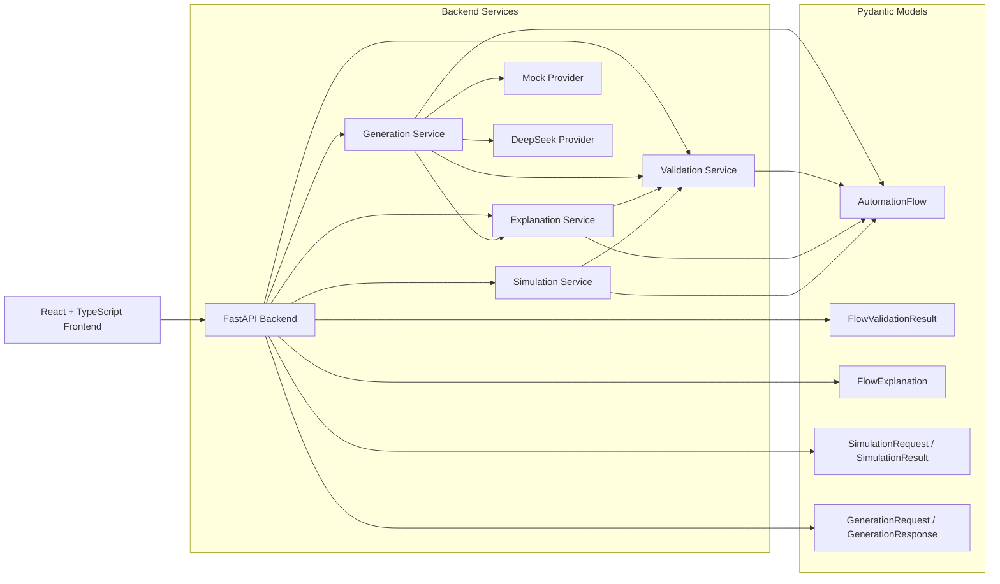

# FlowPilot Architecture

FlowPilot is split into a React frontend and a FastAPI backend. The backend owns workflow models, validation, explanation, generation, and simulation. The frontend is a demo surface for the prompt-to-simulation lifecycle.

## Frontend

- React
- TypeScript
- Vite
- Tailwind CSS

Responsibilities:

- collect workflow prompts;
- call generation and simulation APIs;
- display workflow overview, validation findings, explanation, simulation transcript, execution trace, and raw JSON;
- keep UI state local to the demo page.

## Backend

- FastAPI
- Pydantic v2
- Pytest

Responsibilities:

- expose stateless API endpoints;
- validate request and response models;
- coordinate deterministic services;
- return structured results and errors.

## Core Services

- **Generation Service**: creates supported workflow templates from natural-language prompts and returns structured generation outcomes.
- **Mock Provider**: deterministic, offline workflow generation for stable demo behavior.
- **DeepSeek Provider**: optional OpenAI-compatible chat completion adapter for real LLM generation.
- **Validation Service**: checks graph structure and business rules with deterministic findings.
- **Explanation Service**: produces concise plain-English workflow explanations and risk summaries.
- **Simulation Service**: executes mock workflows with supplied user inputs, mock API outcomes, transcripts, traces, and step limits.

## Diagram



## API Endpoints

```text
GET  /health
POST /api/flows/generate
POST /api/flows/validate
POST /api/flows/explain
POST /api/flows/simulate
```

## Safety Boundaries

- Pydantic validates schema and typed node configuration.
- LLM output is parsed as JSON and validated as `AutomationFlow` before it is returned.
- Generated flows are validated before simulation.
- Simulation does not call external services.
- API-call nodes require mock outcomes.
- Step limits stop repeated loops.
- Structured results are returned for validation findings and simulation failures.

## LLM Provider Configuration

Mock mode is the default:

```env
LLM_PROVIDER=mock
```

DeepSeek mode is optional:

```env
LLM_PROVIDER=deepseek
DEEPSEEK_API_KEY=
DEEPSEEK_BASE_URL=https://api.deepseek.com
DEEPSEEK_MODEL=deepseek-chat
LLM_TIMEOUT_SECONDS=30
```

The DeepSeek prompt constrains the node vocabulary and requests JSON only. The generated content is not executed; it must pass schema validation and deterministic graph validation first.
